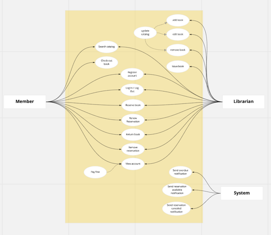

## Library Management system

A Library Management System is a software built to handle the primary housekeeping functions of a library. Libraries rely on library management systems to manage asset collections as well as relationships with their members. Library management systems help libraries keep track of the books and their checkouts, as well as members’ subscriptions and profiles.

Library management systems also involve maintaining the database for entering new books and recording books that have been borrowed with their respective due dates.

### Set of requirements

- Any system actor should be able to search books by their title, author,
publication date and category
  
- Member can login / logout

- Members have profile where they can see their reservations and borrowed books

- Books have unique identifier

- Members have unique identifier

- There could be more than one copy of the book

- There should be a limitation on how many books a member can check-out and
how many days can keep a book
  
- Members should be able to reserve a book even they are not currently available

- The system collects fines for books returned after due date

- The system should send notification when books is available or due is passed

- Unique barcodes on members' and books' cards

